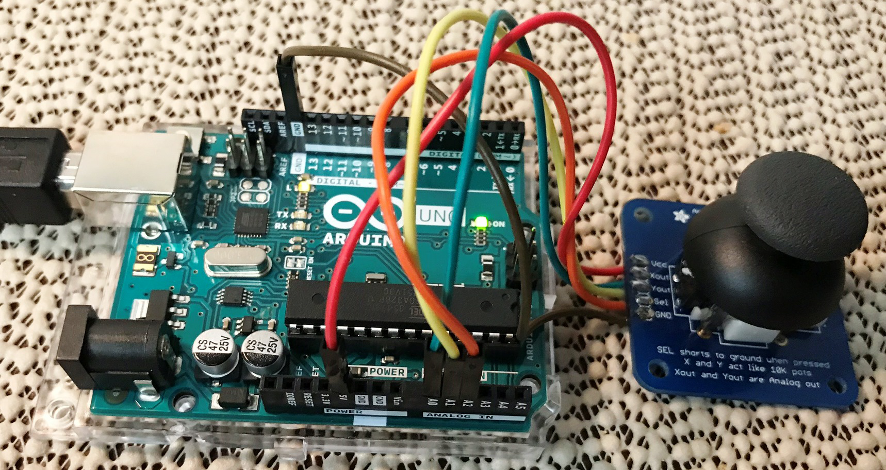
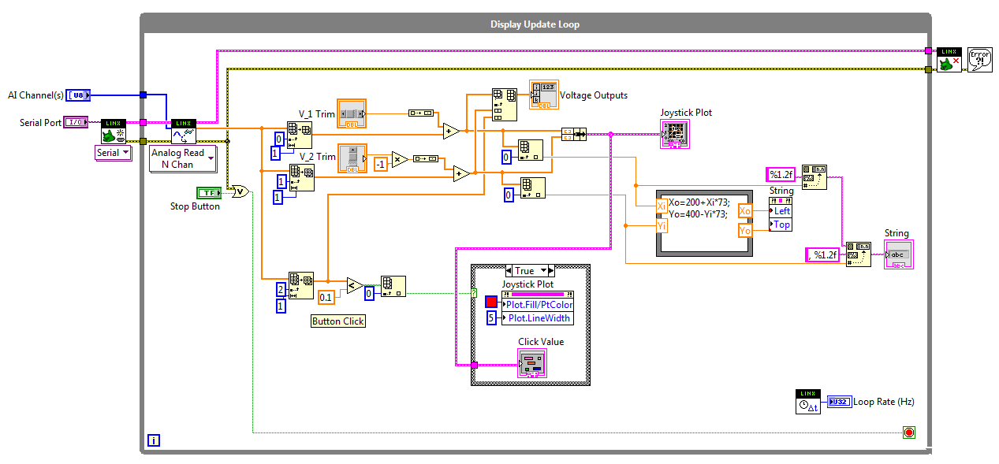

# Arduino/Labview Joystick Interface
The purpose of this project was to develop a LabVIEW interface to an analog joystick using the LINX library for Arduino.
## Hardware
The joy stick is a thumb controlled 2 axis unit with a push to select feature. The joystick was built using the [Adafruit Joystick](https://www.adafruit.com/product/512) breakout board kit. Wires were soldered to the breakout board in lieu of a header. The X, Y, and "Select" lines are analog outputs generated by the joystick potentiometers and are connected to A0, A1, and A2 analog inputs of the Arduino respectively. 5VDC is used to power the Joystick so the center voltage for all inputs to the Arduino is 2.5VDC. Clicking the joystick down grounds the Select input which can be interpreted similar to a mouse click.
*Hardware Setup*
## Software
The joystick interface GUI is developed in LabVIEW (Ver.2014) and uses the LINX open source hardware periferal library by Digilent/LabVIEW MakerHub. LINX is used to develop embedded applications using LabVIEW and includes VIs for accessing peripherals like digital I/O, analog I/O, PWM, I2C, SPI, and UART. Here are the directions for adding [LINX support for the Arduino](https://www.labviewmakerhub.com/doku.php?id=learn:tutorials:libraries:linx:getting_started). Make sure NI VISA is installed for LabVIEW. LabVIEW communicates with the Arduino over a serial connection while the Arduino gaththers data from its various hardware interfaces.
*LabVIEW Block Diagram*
## Operation
The VI provides X and Y trim sliders to center the cursor on the graph screen. Moving the joystick results in cooresponding movement of the cursor and tracks the output voltages. Clicking the Joystick marks the selection temporarily with a red dot and records the selection in the controls and indicators section. A novel feature is a string indicator for the coordinates that track with the movement of the cursor.
* Operation Demo*
